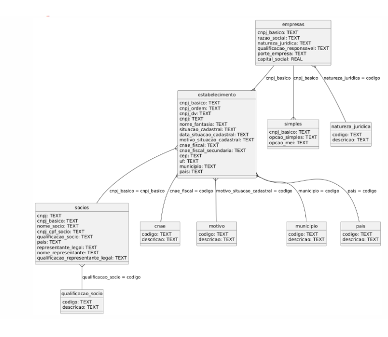

📊 Análise de Empresas por CNAE

Este projeto tem como objetivo analisar o mercado de empresas brasileiras com base nos dados públicos da Receita Federal, utilizando o código CNAE como chave de segmentação. A análise visa identificar potenciais clientes, oportunidades regionais e estimar o market share atual e potencial por produto.

## 🗂 Estrutura do Projeto

O projeto está organizado em três etapas principais:

### `1 - Extract & Load`

Contém os scripts do repositório [rictom/cnpj-sqlite](https://github.com/rictom/cnpj-sqlite), utilizados para:

- Fazer o download automatizado dos arquivos públicos de CNPJ da Receita Federal;
- Descompactar os arquivos e importar para um banco de dados SQLite;
- Gerar um banco `.db` com todas as tabelas da base CNPJ atualizada.

O estudo em questão utilizará o resultado desta etapa no seguinte modelo.

---

### `2 - Transformation`

Scripts SQL utilizados para:

- Reduzir e tratar o banco original, que possui dezenas de GB;
- Gerar tabelas intermediárias e finais com os dados relevantes para a análise;
- Normalizar colunas como CNAE, natureza jurídica, situação cadastral, Simples/MEI, etc.;
- Manter histórico mensal da base para análises comparativas.

> 🔄 Essa etapa prepara os dados para consumo direto no Power BI, otimizando performance e facilitando análises recorrentes.

---

### `3 - Visualization`

Contém os arquivos `.pbip` do Power BI, que representam a solução final de visualização, incluindo:

- Relatórios interativos com as KPIS levantadas inicialmente;
- Métricas como taxa de atendimento de mercado, receita potencial por região, top produtos por segmento;
- Versionamento completo para rastreamento de mudanças nas análises e visuais.

> 🧠 Essa camada transforma os dados brutos em insights acionáveis para tomada de decisão comercial.

---

## 🛠 Tecnologias Utilizadas

- Python (extração automatizada)
- SQLite (armazenamento e transformação de dados)
- SQL (tratamentos e modelagem)
- Power BI (.pbip – visualização e análise)
- VS Code (ambiente de desenvolvimento)

---

## 📄 Licença

Este projeto é de uso acadêmico. Os dados utilizados são públicos e disponibilizados pela Receita Federal do Brasil. O uso comercial das análises deve respeitar os termos da fonte de dados original.

---
