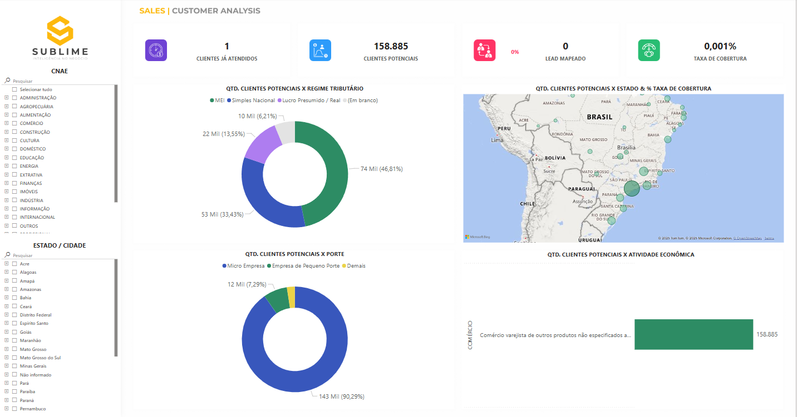

# Análise de Mercado por CNAE

Este projeto tem como objetivo analisar o mercado brasileiro a partir de dados públicos da Receita Federal, segmentando empresas por CNAE e cruzando com informações internas para geração de KPIs estratégicos.

---

## 📁 Estrutura de Pastas

```
.
├── 1 - Extract & Load           # Criação do banco .db a partir dos dados públicos
├── 2 - Transformation           # Script Python para gerar os dados analisáveis
├── 3 - Visualization            # Arquivo .pbip do Power BI
├── inputs/                      # Contém vendas.csv e leads.csv
├── intermediarios/
│   ├── bronze/                  # Dados extraídos e limpos (parquet)
│   └── silver/                  # CNAEs e CNPJs alvo gerados
├── outputs/
│   └── gold/                    # Tabelas finais consumidas pelo Power BI (.parquet)
└── images/                      # Prints e gráficos do projeto
```

---

## 1️⃣ Extract & Load

Nesta etapa, utilizamos o repositório [rictom/cnpj-sqlite](https://github.com/rictom/cnpj-sqlite) para:

- Baixar e descompactar os arquivos públicos da Receita Federal;
- Importar os dados para SQLite;
- Gerar o banco `cnpj.db` com as tabelas de CNPJ, estabelecimento, empresas, sócios, etc.

O banco gerado será salvo em:

```
1 - Extract & Load/dados-publicos/cnpj.db
```

O objetivo de ter utilizado esse método é facilitar as consultas SQL para validações e testes antes de criar o código .py. 
Este banco é o ponto de partida para a etapa de transformação.

---

## 2️⃣ Transformation

Este passo executa a geração dos dados analíticos com **Python + Dask + Pandas**.
Obs.: Até o momento acredito que computadores com menos poder de processamento e memória poderão não atender a demanda desta etapa.

### 📂 Formato dos Arquivos de Input

Os arquivos devem estar na pasta `inputs/` com os seguintes formatos:

#### `vendas.csv`

Contém os registros de vendas realizadas para clientes da empresa.

| Coluna             | Descrição                                      |
|--------------------|-----------------------------------------------|
| `it-codigo`        | Código do item vendido                        |
| `familia`          | Família do item                               |
| `familia_comercial`| Classificação comercial da família            |
| `cnpj`             | CNPJ do cliente                               |
| `cliente`          | Nome ou descrição do cliente                  |
| `valor`            | Valor da venda (pode conter casas decimais)  |

➡️ Se alguma informação não estiver disponível, a coluna correspondente deve ser deixada **vazia**, mas o cabeçalho deve permanecer.

#### `leads.csv`

Contém os potenciais leads da área comercial.

| Coluna   | Descrição                     |
|----------|------------------------------|
| `cnpj`   | CNPJ do lead (obrigatório)   |
| `data`   | Data de prospecção (opcional)|

➡️ A coluna `data` pode ser deixada vazia se não disponível, mas deve estar presente no cabeçalho.

### 📜 O script:
- Filtra estabelecimentos ativos (`situacao_cadastral = '02'`)
- Gera os CNAEs utilizados pelos clientes
- Identifica os CNPJs de interesse para análise de mercado
- Realiza joins com dados cadastrais, tributários e de porte
- Cria dimensões: CNAE, Município, Porte da Empresa e Regime Tributário
- Gera arquivos `.parquet` finais na pasta `outputs/gold`

---

### Tabelas geradas (gold):

| Nome do Arquivo                      | Tipo         | Descrição                                                        |
|-------------------------------------|--------------|------------------------------------------------------------------|
| `fato_empresas.parquet`             | Fato         | Empresas ativas com dados enriquecidos e flags (cliente, lead)   |
| `dim_cnae.parquet`                  | Dimensão     | CNAEs com seções e descrições                                    |
| `dim_municipio.parquet`            | Dimensão     | Municípios ativos com nome, UF e CEP                             |
| `dim_porte_empresa.parquet`        | Dimensão     | Tabela de porte com códigos e descrições                         |
| `dim_regime_tributario.parquet`    | Dimensão     | Regime tributário (MEI, Simples, Lucro Real/Presumido)           |

---

## 3️⃣ Visualization (Power BI)

O arquivo Power BI (`.pbip`) está localizado em:

```
3 - Visualization/
```

### 📌 Requisitos:
- Ajustar o parâmetro `CaminhoParquet` no Power BI para apontar para a pasta `outputs/gold` local
- Atualizar os dados após a execução do script Python

### 🎯 Dashboards incluídos:
- Taxa de atendimento do mercado por CNAE
- Volume de empresas ativas por porte e segmento
- Potencial de receita por região
- Comparativo entre clientes, leads e empresas do mercado



---

## 🧰 Tecnologias Utilizadas

| Tecnologia            | Uso                                                                 |
|------------------------|----------------------------------------------------------------------|
| **Python**             | Automação do pipeline de dados com Dask, Pandas e PyArrow           |
| **SQLite**             | Armazenamento intermediário de dados públicos da Receita Federal    |
| **Power BI**           | Visualização de dados e criação dos dashboards                      |
| **DBeaver**            | Gerenciamento e consulta do banco `.db`                             |
| **Visual Studio Code** | Desenvolvimento de scripts Python e SQL                             |
| **GitHub**             | Versionamento e controle do projeto                                 |

---

## ✅ Como Executar

1. **Execute a etapa `Extract & Load`** para gerar o `cnpj.db`
2. **Adicione os arquivos `vendas.csv` e `leads.csv` na pasta `inputs/`**
3. **Execute o script `transformation.py` em `2 - Transformation`**
4. **Abra o Power BI (`.pbip`) e atualize o parâmetro de caminho**
5. **Atualize os dados no Power BI**

## 🔜 Melhorias Futuras

O projeto poderá ser expandido com as seguintes melhorias estratégicas e operacionais:

1. **Clusterização de Clientes**
   - Agrupar clientes com características e comportamentos semelhantes para facilitar ações comerciais segmentadas.

2. **Recomendação de Produtos**
   - Sugerir produtos com base no perfil de compra de clientes semelhantes, aumentando o potencial de vendas cruzadas.

3. **Automação do Processo de Análise**
   - Unificação e encadeamento de todas as etapas (extração, transformação e visualização) para reduzir a intervenção manual.

4. **Otimização de Recursos Computacionais**
   - Ajustes no processamento para melhorar o desempenho em ambientes com restrição de memória e tempo de execução.

5. **Validação e Qualidade dos Dados**
   - Inclusão de verificações para garantir que os dados analisados estejam completos, corretos e consistentes.

6. **Análise Temporal**
   - Adição de perspectivas ao longo do tempo, como evolução do número de empresas, tendências por setor e sazonalidades.

7. **Enriquecimento Analítico**
   - Incorporação de atributos complementares que ajudem a entender melhor o contexto de mercado e o perfil das empresas.

8. **Monitoramento Contínuo de Novas Empresas**
   - Identificação periódica de empresas recém-abertas ou com mudanças cadastrais, com foco nos segmentos estratégicos.

9. **Aprimoramento dos Indicadores**
   - Expansão e refinamento dos KPIs existentes para suportar análises mais profundas e específicas.
